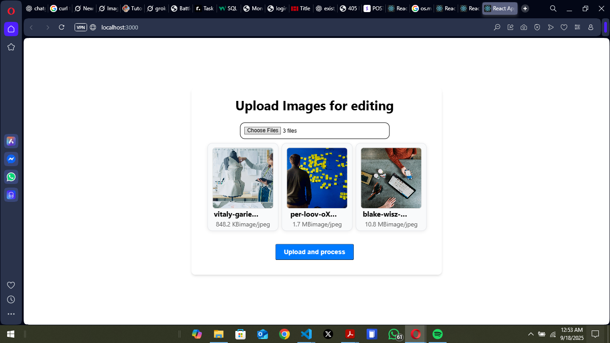

# Picture Upload App

This is a simple full-stack project that allows users to upload images, process them into **three different styles**, and download the results:

* 🎨 **Cartoon style**
* 🖤 **Black & White**
* 🌅 **Sepia tone**

The app is built with:

* **Frontend:** React (no extra frameworks)
* **Backend:** Flask (Python)

---

## 📂 Project Structure

```
project-root/
│── backend/        # Flask app
│   └── app.py
│── frontend/       # React app
│   └── src/App.js
│── README.md
```

---

##  Features

* Upload multiple images at once.
* Each image is transformed into **3 styles**.
* Processed images are grouped into folders (`sepia`, `BW`, `cartoon`).
* Download all results as a single `.zip` file.

---

## 🔧 Setup Instructions

### 1. Clone the repository

```bash
git clone <your-repo-url>
cd project-root
```

---

### 2. Backend (Flask)

1. Navigate to backend folder:

   ```bash
   cd backend
   ```

2. Create and activate a virtual environment:

   ```bash
   # Linux/Mac
   python3 -m venv venv
   source venv/bin/activate

   # Windows
   python -m venv venv
   venv\Scripts\activate
   ```

3. Install dependencies:

   ```bash
   pip install -r requirements.txt
   ```

   *(If you don’t have a `requirements.txt`, create one with the following packages)*

   ```txt
   flask
   flask-cors
   pillow
   opencv-python
   numpy
   werkzeug
   ```

4. Run the Flask server:

   ```bash
   python app.py
   ```

   The backend will start at:
   👉 `http://127.0.0.1:5000`

---

### 3. Frontend (React)

1. Navigate to the frontend folder:

   ```bash
   cd ../frontend
   ```

2. Install dependencies:

   ```bash
   npm install
   ```

3. Start the React development server:

   ```bash
   npm start
   ```

   The frontend will run at:
   👉 `http://localhost:3000`

### Screenshot



---

## Usage

1. Open the React app in your browser.
2. Select and upload one or more images.
3. The backend processes the images into:

   * **Sepia**
   * **Black & White**
   * **Cartoon**
4. A `.zip` file containing all results will be returned.

---

## Tech Stack

* **Frontend:** React (hooks, Axios)
* **Backend:** Flask, Pillow, OpenCV, NumPy
* **Others:** Flask-CORS for frontend-backend communication

---

## Future Improvements

* Add image preview after processing.
* Support drag-and-drop uploads.
* Deploy with Docker or on cloud services.

